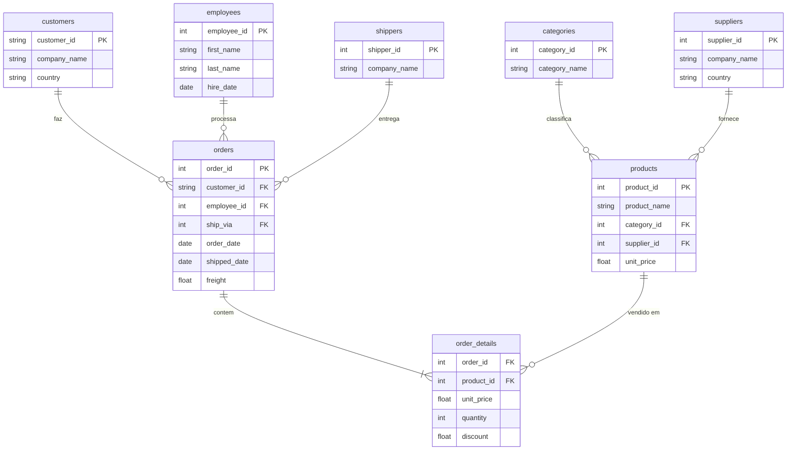
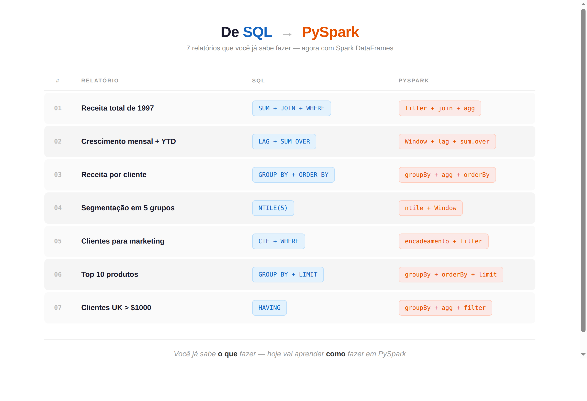

# Aula 08 - PySpark DataFrame API com Northwind

## Objetivo

Dominar a **PySpark DataFrame API** de forma pratica, reconstruindo 7 relatorios analiticos do banco Northwind — que os alunos ja conhecem em SQL — agora usando Spark puro.

Este e o primeiro mergulho profundo em PySpark da trilha. Ate agora os alunos usaram Databricks principalmente via SQL, Unity Catalog, DLT e Lakeflow. Agora vamos escrever **codigo PySpark do zero**.

---

## Resumo da Aula

| Bloco | Tema | O que voce vai aprender |
|-------|------|------------------------|
| **01** | Leitura e Exploracao | `spark.table()`, `spark.read` (CSV/JSON/Parquet/Delta), schema explicito com `StructType`, `printSchema()`, `display()` |
| **02** | Transformacoes | `select`, `filter`, `withColumn`, `when/otherwise`, funcoes de string, data e tratamento de nulos |
| **03** | Agregacoes e Joins | `groupBy().agg()`, 7 tipos de join (inner, left, right, full, anti, semi, broadcast), HAVING |
| **04** | Window Functions | `row_number`, `rank`, `lag/lead`, soma acumulada, `ntile`, pivot tables, UDFs |
| **05** | Escrita e Projeto Final | Modos de escrita, `partitionBy`, `repartition` vs `coalesce`, pipeline completo Bronze → Gold |

**Ao final da aula**, o aluno tera construido um pipeline completo: leitura de 5 tabelas → transformacoes e joins → 5 relatorios analiticos salvos como tabelas Delta na camada Gold.

---

## Dataset: Northwind Traders

O Northwind e um banco de dados classico de uma empresa ficticia de importacao/exportacao de alimentos. E um ERP completo com 8 tabelas principais.

### Diagrama ER


### Tabelas

| Tabela | Registros | Descricao |
|--------|-----------|-----------|
| `customers` | 91 | Clientes da empresa |
| `orders` | 830 | Pedidos de venda |
| `order_details` | 2.155 | Itens de cada pedido |
| `products` | 77 | Catalogo de produtos |
| `categories` | 8 | Categorias de produtos |
| `employees` | 9 | Funcionarios/vendedores |
| `suppliers` | 29 | Fornecedores |
| `shippers` | 3 | Transportadoras |

### Formula Central de Receita

```
receita = unit_price * quantity * (1.0 - discount)
```

### Relacionamentos



---

## Estrutura do Projeto

```
aula_08/
├── README.md
├── .llm/
│   └── prd.md                                  # PRD com definicao completa
├── dataset/
│   ├── create_tables.sql                       # DDL — cria catalogo, schema e tabelas
│   ├── insert_tables.sql                       # DML — popula todas as tabelas
│   └── delete_tables.sql                       # DROP CASCADE — reseta tudo do zero
└── notebooks/
    ├── bloco_01_leitura.ipynb                  # Versao para aula (celulas vazias)
    ├── bloco_01_leitura_full.ipynb             # Gabarito completo
    ├── bloco_02_transformacoes.ipynb
    ├── bloco_02_transformacoes_full.ipynb
    ├── bloco_03_agregacoes_joins.ipynb
    ├── bloco_03_agregacoes_joins_full.ipynb
    ├── bloco_04_window_functions.ipynb
    ├── bloco_04_window_functions_full.ipynb
    ├── bloco_05_escrita_projeto.ipynb
    └── bloco_05_escrita_projeto_full.ipynb
```

> **Convencao:** cada bloco tem duas versoes:
> - `bloco_XX.ipynb` — versao para aula ao vivo (celulas de codigo vazias, markdown intacto)
> - `bloco_XX_full.ipynb` — gabarito com todo o codigo

---

## Conteudo por Bloco

### Bloco 01 — Leitura e Exploracao de Dados (~50 min)

- `spark.table()` e `spark.read.csv()` / `.json()` / `.parquet()` / `.format("delta")`
- Schema inference vs schema explicito com `StructType`
- Exploracao: `display()`, `printSchema()`, `describe()`, `count()`
- DataFrame API vs `spark.sql()` — equivalencia

### Bloco 02 — Transformacoes Essenciais (~60 min)

- `select()`, `filter()`, `withColumn()`, `drop()`, `distinct()`
- `col()`, `lit()`, `when().otherwise()`, `cast()`
- Strings: `upper()`, `lower()`, `concat()`, `split()`
- Datas: `year()`, `month()`, `datediff()`, `to_date()`
- Nulos: `isNull()`, `coalesce()`, `fillna()`, `dropna()`
- **Formula central:** `receita = unit_price * quantity * (1.0 - discount)`

### Bloco 03 — Agregacoes e Joins (~50 min)

- `groupBy().agg()` com multiplas agregacoes
- `orderBy()`, `limit()`
- Joins: inner, left, right, full, anti, semi
- `broadcast()` para tabelas pequenas
- Filtro pos-agregacao (equivalente HAVING)
- **4 relatorios Northwind:**
  1. Receita total 1997
  2. Receita por cliente
  3. Top 10 produtos
  4. Clientes UK com pagamento > 1000

### Bloco 04 — Window Functions (~40 min)

- `Window.partitionBy().orderBy()`
- Ranking: `row_number()`, `rank()`, `dense_rank()`
- Analiticas: `lead()`, `lag()`, `sum().over()`
- `ntile()` para segmentacao
- Pivot tables
- **3 relatorios Northwind:**
  5. Receitas acumuladas mensais com YTD
  6. Segmentacao de clientes (5 grupos)
  7. Clientes para marketing

### Bloco 05 — Escrita e Projeto Final (~40 min)

- Formatos: Delta, Parquet, CSV
- Modos: overwrite, append, error, ignore
- `partitionBy()` na escrita
- `repartition()` vs `coalesce()`
- **Projeto final:** Pipeline completo leitura -> transformacao -> escrita
  - 5 relatorios analiticos salvos como Delta tables
  - CSV de exportacao

---

## SQL vs PySpark — Tabela de Equivalencia

| Operacao | SQL | PySpark DataFrame API |
|----------|-----|----------------------|
| Leitura | `SELECT * FROM table` | `spark.table("table")` |
| Selecao | `SELECT col1, col2` | `df.select("col1", "col2")` |
| Filtro | `WHERE condition` | `df.filter(condition)` |
| Nova coluna | `col AS alias` | `df.withColumn("alias", expr)` |
| Join | `JOIN ... ON ...` | `df1.join(df2, "key")` |
| Agregacao | `GROUP BY ... SUM(...)` | `df.groupBy(...).agg(F.sum(...))` |
| Ordenacao | `ORDER BY col DESC` | `df.orderBy(F.col("col").desc())` |
| Limite | `LIMIT 10` | `df.limit(10)` |
| Having | `HAVING condition` | `.agg(...).filter(condition)` |
| Window | `SUM() OVER (PARTITION BY ...)` | `F.sum().over(Window.partitionBy(...))` |
| Ranking | `RANK() OVER (ORDER BY ...)` | `F.rank().over(Window.orderBy(...))` |
| NTILE | `NTILE(5) OVER (...)` | `F.ntile(5).over(w)` |
| Pivot | N/A (complexo) | `df.groupBy(...).pivot(...).agg(...)` |

---

## 7 Relatorios Analiticos

Estes relatorios SQL do Northwind sao reconstruidos em PySpark nos notebooks:



| # | Relatorio | Bloco | Conceitos PySpark |
|---|-----------|-------|-------------------|
| 1 | Receita total 1997 | 03 | `filter(year)`, `join`, `agg(sum)` |
| 2 | Receita por cliente | 03 | multi-join, `groupBy`, `orderBy(desc)` |
| 3 | Top 10 produtos | 03 | `join`, `groupBy`, `orderBy`, `limit` |
| 4 | Clientes UK > 1000 | 03 | `filter(country)`, `groupBy`, filtro pos-agg |
| 5 | Receitas acumuladas YTD | 04 | `Window(SUM OVER, LAG)`, encadeamento |
| 6 | Segmentacao de clientes | 04 | `groupBy` + `ntile()` Window |
| 7 | Clientes para marketing | 04 | `ntile` + `filter` |

---

## Como Executar

### Pre-requisitos

1. Acesso ao Databricks Workspace
2. Cluster Spark configurado (DBR 13+)
3. Catalogo Unity Catalog disponivel

### Passos

1. **Criar o dataset Northwind:**
   - Execute `dataset/create_tables.sql` — cria catalogo, schema e tabelas
   - Execute `dataset/insert_tables.sql` — popula todas as tabelas com dados

2. **Executar os notebooks na ordem:**
   - Use os `bloco_XX.ipynb` (versao limpa) para aula ao vivo
   - Use os `bloco_XX_full.ipynb` como gabarito de referencia

3. **Resetar o projeto (opcional):**
   - Execute `dataset/delete_tables.sql` para apagar tudo e comecar do zero

---

## Imports Padrao

```python
from pyspark.sql import functions as F
from pyspark.sql.window import Window
from pyspark.sql.types import StructType, StructField, StringType, IntegerType, FloatType, DateType
```

---

## Recursos Adicionais

- [Documentacao PySpark](https://spark.apache.org/docs/latest/api/python/)
- [PySpark SQL Functions](https://spark.apache.org/docs/latest/api/python/reference/pyspark.sql/functions.html)
- [Databricks PySpark Guide](https://docs.databricks.com/spark/latest/dataframes-datasets/introduction-to-dataframes-python.html)
